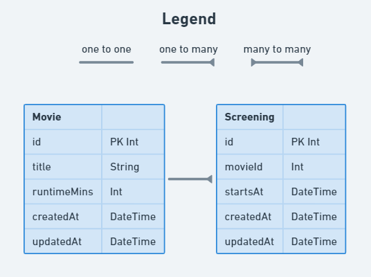

# Movie & Screening relationship



## Instructions

- Add the relevant relationship between `Movie` and `Screening`.
- Use [this documentation](https://www.prisma.io/docs/concepts/components/prisma-schema/relations/one-to-many-relations) as a guide.

## An explanation of the `@relation` attribute

When defining a relationship where multiple records are involved (one movie can have many screenings), we begin to see a new attribute in our schema: `@relation`.

This is the function Prisma uses to create the right relationship based on two parameters that you provide: the ID foreign key property on the *current* model, and the ID primary key on the target model that it's related to. Let's use Prisma's own example:

```js
model User {
  id    Int    @id @default(autoincrement())
  posts Post[]
}

model Post {
  id        Int     @id @default(autoincrement())
  user      User    @relation(fields: [userId], references: [id])
  userId    Int
}
```

This example shows that **one** `User` can have **many** `Posts`. On the `User` model, there is a property called `posts` which has a type of `Post[]` - the `[]` means an array of `Post` models.

To complete the relation, we need to provide the appropriate ID on the `Post` model. `Post` has a property named `userId` with a type of `Int`, this is what will store the related user's ID. It also has a property of `user` with a type of `User`, this is where we define the actual relation.

The `@relation()` attribute here has two named parameters - `fields` and `references`. `fields` refers to which property on the `Post` model stores the user's ID, and `references` refers to that same property but on the `User` model itself.

```js
// The Post.userId field references the User.id field
@relation(fields: [userId], references: [id])
```